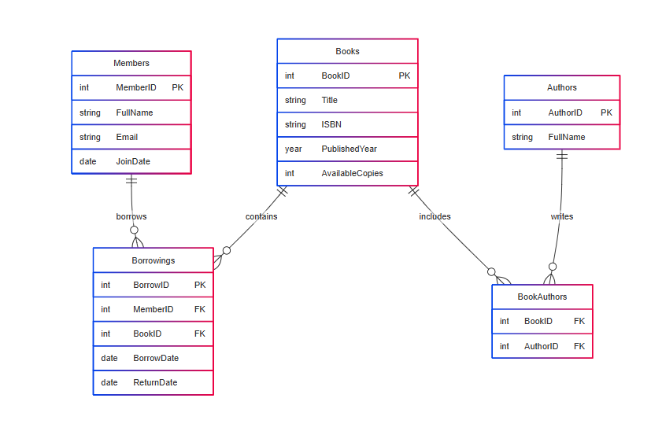

# 📚 Library Management Database

## 📋 Project Description

The **Library Management Database** is a MySQL-based relational database designed to manage library resources efficiently. It tracks members, authors, books, and borrowing records, supporting key functionalities like book tracking, author management, and borrowing history. The schema uses multiple tables to capture relationships between members, books, and authors.

## 🗂️ Database Schema

The database includes the following tables:

1. **Members** - Stores information about library members.
2. **Authors** - Stores information about authors.
3. **Books** - Stores information about books, including title, ISBN, and availability.
4. **BookAuthors** - Handles the many-to-many relationship between books and authors.
5. **Borrowings** - Handles the many-to-many relationship between members and books.

## 🚀 Setup Instructions

1. Ensure you have **MySQL** installed and running on your machine.
2. Clone or download this repository.
3. Open your preferred MySQL client (e.g., MySQL Workbench or command-line interface).
4. Run the commands in the library_management sql file to create the database and tables, then insert sample data:

## 🖼️ ERD (Entity-Relationship Diagram)  
Here is the visual representation of the database structure:  

